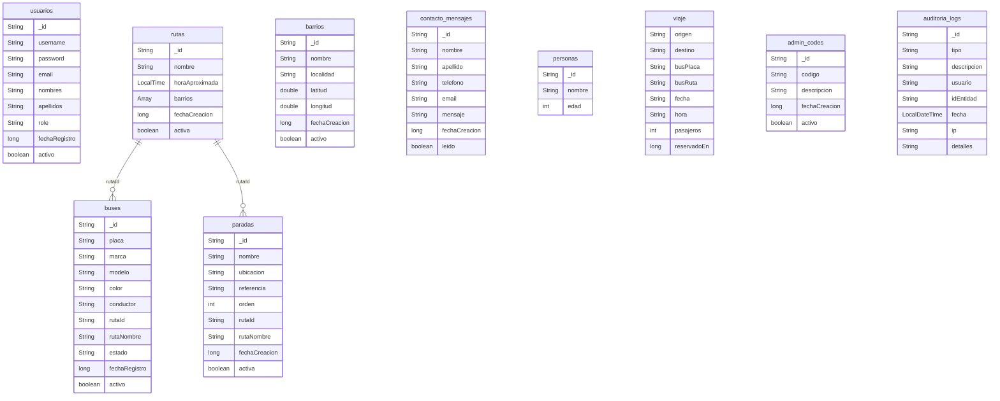

# MongoDB Database Diagram

Este archivo describe la estructura NoSQL que ya está implementada en el proyecto `aula` y documenta las colecciones de MongoDB usadas por la aplicación.

## Conexión MongoDB
- URI configurada en `BOOT-INF/classes/application-dev.properties`
- `spring.data.mongodb.uri=mongodb://localhost:27017/proyectobd`
- Base de datos: `proyectobd`

## Colecciones principales
- `usuarios`
- `rutas`
- `buses`
- `paradas`
- `barrios`
- `contacto_mensajes`
- `personas`
- `viaje` (embebido en usuarios)
- `admin_codes`
- `auditoria_logs`

## Diagrama de datos

## Población de datos
El proyecto incluye un script de migración en `migrate_to_mongodb.py` que toma datos de MySQL (`yorbisbd`) y los inserta en MongoDB (`proyectobd`).

## Ubicación de la implementación
- Documentos MongoDB: `src/main/java/com/proaula/aula/document`
- Repositorios MongoDB: `src/main/java/com/proaula/aula/Repository/mongodb`
- Documentación de migración: `GUIA_MYSQL_MONGODB.md`, `MIGRACION_MONGODB.md`
- Script de migración: `migrate_to_mongodb.py`
